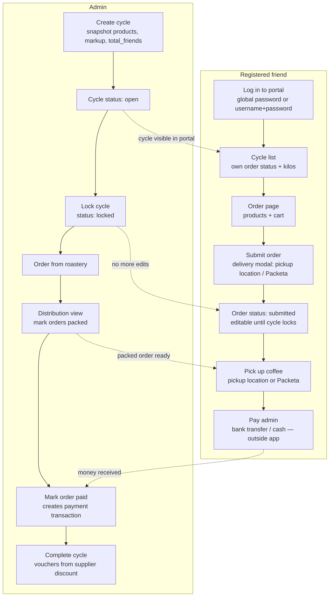
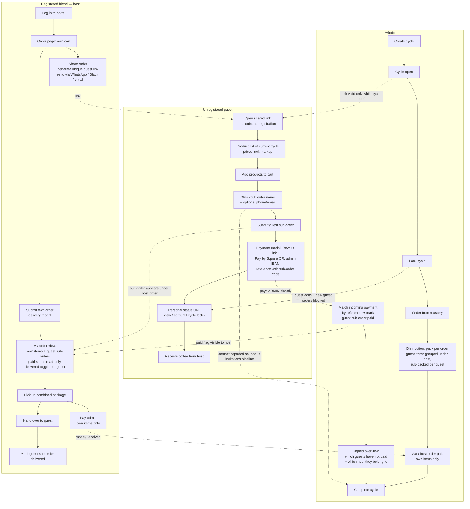
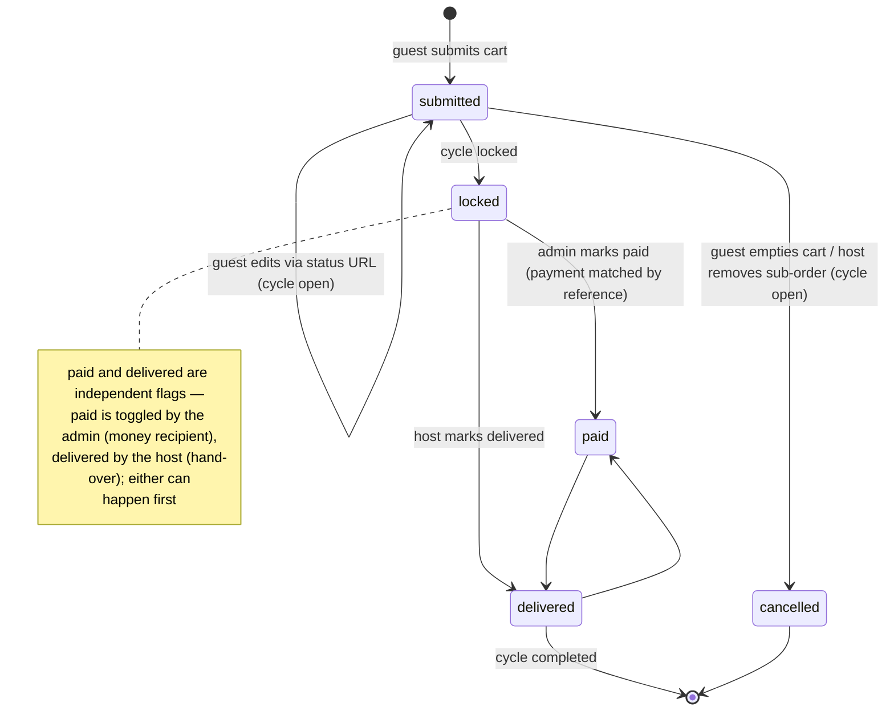
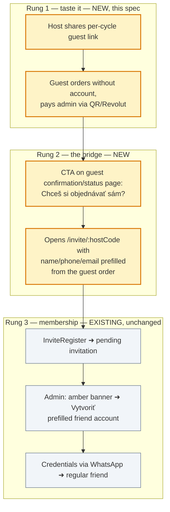

# Guest Shared Orders — Design Spec

**Date:** 2026-07-18
**Status:** Draft — process diagrams + core design for review

## Goal

Let a registered friend (the **host**) share a unique link with unregistered people
(**guests** — typically colleagues). A guest can browse the products of the current
open cycle, build a cart, submit a **guest sub-order**, and pay the admin directly
(Revolut / Pay by Square QR) — all without registering. The guest sub-order lives
*under* the host's account: the host sees it (including its payment status) and
marks it as delivered (the host is responsible for handing the coffee over to the
guest). The **admin** owns payment tracking per sub-order — marks it paid when the
money arrives and can see at a glance which guests haven't paid.

Business goal: more kilos per cycle (tier thresholds) + captured guest contacts as
warm leads for the existing invitations pipeline.

## Current Ordering Process



Key properties of the current flow:

- One order per (friend, cycle). Order rows: `orders` (status `draft`/`submitted`,
  `paid`, `packed`), items in `order_items`.
- Payment happens **outside the app**; admin records it by toggling `paid`, which
  creates a `payment` transaction against the friend's balance.
- Delivery = friend picks up at a pickup location or via Packeta. Nothing in the
  app tracks hand-over beyond `packed`.

## New Process — Guest Sub-Orders Under a Friend's Order



### Guest sub-order lifecycle



## Key Design Decisions

### 1. Guests pay the admin directly — same Revolut + Pay by Square flow as friends

Friends already pay the admin directly through `PaymentModal.vue`: a
`revolut.me/<username>` link plus a Pay by Square QR generated from the admin's
IBAN (both from settings: `paymentIban`, `paymentRevolutUsername`), with payment
note `FriendName / CycleName`. Guest sub-orders reuse this exact flow:

- After submitting, the guest sees the **same payment modal**: Revolut link +
  Pay by Square QR with the exact sub-order amount and a payment reference of the
  form **`G<id> / GuestName / CycleName`** (e.g. `G12 / Marek / Máj 2026`). The
  `G<id>` code makes the incoming payment unambiguous even with duplicate first
  names. The Revolut path can't pre-fill a note, so the confirmation screen
  explicitly tells the guest to paste the reference into the Revolut note. The
  modal is also re-openable from the guest's status URL ("Zaplatiť").
- The **admin** matches incoming payments by reference and toggles `paid` on the
  sub-order (admin cycle view, nested under the host order). An **unpaid
  overview** — guest name, amount, host, contact — makes it obvious who hasn't
  paid; the existing `unpaid_count` per cycle includes guest sub-orders.
- The **host** sees the paid status of their guests read-only; their own payable
  total to the admin covers **their own items only**. Guest sub-orders are the
  admin's receivables, not the host's — the host's responsibility is delivery,
  not settlement.
- Guest `paid` flags do not create `transactions` rows (guests have no balance
  account); `paid`/`paid_at` on `guest_orders` is the whole bookkeeping.

A real payment gateway (Stripe/GoPay) remains out of scope for v1; payment is
still confirmed manually by the admin, exactly as with friend orders today.

### 2. Separate tables, not rows in `orders`

Guest sub-orders get their own tables (`guest_orders`, `guest_order_items`)
instead of reusing `orders` with a `parent_order_id`:

- Many existing aggregations key on `orders` per friend: cycle progress
  (`submittedOrders/totalFriends`), analytics segmentation, vouchers, rewards.
  Guest rows inside `orders` would silently corrupt all of them.
- A guest sub-order must be attachable to `(host_friend_id, cycle_id)` even when
  the host hasn't submitted their own order yet, so a FK to `orders.id` is wrong
  anyway.
- Cycle totals / tier progress / distribution explicitly JOIN the guest tables
  where guest kilos should count (they should — that's the point of the feature).

### 3. Host gets the kilos credit

Guest kilos count toward the host's rewards/voucher volume (they recruited the
guests and do the delivery). This doubles as the host's incentive to share the
link. Mirrors the existing `is_root`/`root_friend_id` grouping concept.

### 4. Link + edit-token model

- One shareable **guest link per (host, cycle)**: token in `guest_order_links`,
  URL `/g/:token`. Host can regenerate (invalidates old link, keeps existing
  sub-orders) or deactivate.
- After submitting, a guest gets a **personal status URL** `/g/:token/o/:orderToken`
  (also persisted in guest's localStorage) to view status and edit items until the
  cycle locks. No account, no password.
- Links are only usable while the cycle status is `open`. Locked cycle ⇒
  read-only status page.

### 5. Host control over sub-orders

- Guest items land directly in the sub-order (no approval step — friction kills
  group carts), but the host sees every sub-order live in their order view and can
  **remove a whole sub-order** while the cycle is open (typo, prank, colleague
  changed their mind offline).
- Host submitting their own order does **not** block further guest sub-orders;
  only the cycle lock does. The host's own payable total is unaffected by guest
  activity (guests settle directly with the admin), but the order view shows the
  guest sub-orders and their running total live so the host knows what they'll
  be handing over.

## Data Model

```sql
CREATE TABLE guest_order_links (
  id INTEGER PRIMARY KEY AUTOINCREMENT,
  token TEXT UNIQUE NOT NULL,            -- URL token, generateUid()-style
  host_friend_id INTEGER NOT NULL,
  cycle_id INTEGER NOT NULL,
  active INTEGER DEFAULT 1,
  created_at DATETIME DEFAULT CURRENT_TIMESTAMP,
  UNIQUE(host_friend_id, cycle_id),      -- one live link per host per cycle
  FOREIGN KEY (host_friend_id) REFERENCES friends(id) ON DELETE CASCADE,
  FOREIGN KEY (cycle_id) REFERENCES order_cycles(id) ON DELETE CASCADE
);

CREATE TABLE guest_orders (
  id INTEGER PRIMARY KEY AUTOINCREMENT,
  link_id INTEGER NOT NULL,              -- carries host + cycle
  order_token TEXT UNIQUE NOT NULL,      -- guest's personal status/edit URL
  guest_name TEXT NOT NULL,
  guest_phone TEXT,
  guest_email TEXT,
  status TEXT DEFAULT 'submitted' CHECK (status IN ('submitted', 'cancelled')),
  total REAL DEFAULT 0,
  paid INTEGER DEFAULT 0,
  paid_at DATETIME,
  delivered INTEGER DEFAULT 0,
  delivered_at DATETIME,
  created_at DATETIME DEFAULT CURRENT_TIMESTAMP,
  FOREIGN KEY (link_id) REFERENCES guest_order_links(id) ON DELETE CASCADE
);

CREATE TABLE guest_order_items (
  id INTEGER PRIMARY KEY AUTOINCREMENT,
  guest_order_id INTEGER NOT NULL,
  product_id INTEGER NOT NULL,           -- cycle-snapshot products row
  variant TEXT NOT NULL,
  quantity INTEGER NOT NULL DEFAULT 1,
  price REAL NOT NULL,                   -- unit price incl. markup at submit time
  FOREIGN KEY (guest_order_id) REFERENCES guest_orders(id) ON DELETE CASCADE,
  FOREIGN KEY (product_id) REFERENCES products(id) ON DELETE CASCADE
);
```

## API Surface

Public (token-authenticated by URL, no session):

| Method | Path | Purpose |
|---|---|---|
| GET | `/api/guest/:token` | Cycle info + host first name + active products with prices; 410 if link inactive or cycle not open |
| POST | `/api/guest/:token/orders` | Submit guest sub-order `{guest_name, guest_phone?, guest_email?, items[]}` → returns `order_token` + payment info (IBAN, Revolut username, reference `G<id> / name / cycle`, amount) |
| GET | `/api/guest/:token/orders/:orderToken` | Status page data (items, total, paid/delivered, payment info for re-opening the payment modal, cycle status) |
| PUT | `/api/guest/:token/orders/:orderToken` | Edit items while cycle open; empty cart ⇒ status `cancelled` |

Friend (existing `X-Friends-Password` / session auth):

| Method | Path | Purpose |
|---|---|---|
| POST | `/api/guest-links/cycle/:cycleId` | Create or regenerate own link |
| GET | `/api/guest-links/cycle/:cycleId` | Own link + all guest sub-orders for this cycle (incl. read-only paid status) |
| PATCH | `/api/guest-links/:id` | Deactivate link |
| PATCH | `/api/guest-orders/:id/delivered` | Toggle delivered (host only) |
| DELETE | `/api/guest-orders/:id` | Remove sub-order (host only, cycle open) |

Admin:

| Method | Path | Purpose |
|---|---|---|
| PATCH | `/api/guest-orders/:id/paid` | Toggle paid (admin; sets `paid_at`, no `transactions` row) |
| GET | `/api/guest-orders/cycle/:cycleId/unpaid` | Unpaid overview: guest name, amount, reference, host, contact |

Plus: extend existing cycle detail / distribution / live-cycle endpoints to JOIN
guest tables — orders tab shows guest sub-orders nested under host order with a
paid toggle each; kilos, tier progress, and per-cycle `unpaid_count` include
guest sub-orders.

## Frontend

- **`GuestOrder.vue`** — public route `/g/:token` (+ `/g/:token/o/:orderToken`).
  Reuses the FriendOrder product-card layout (incl. bakery variant grouping) but
  stripped: no login, no delivery modal, no drafts. Checkout = name + contact +
  submit. Confirmation screen opens the existing **`PaymentModal.vue`** (Revolut
  link + Pay by Square QR, amount + `G<id>` reference pre-filled) and shows the
  personal status URL; the status page has a "Zaplatiť" button to re-open the
  modal until the admin marks the sub-order paid. Slovak UI.
- **FriendOrder.vue / FriendPortal.vue** — "Zdieľať objednávku s kolegami" action
  (share link + copy button + native share sheet on mobile); section
  "Objednávky kolegov" listing sub-orders with read-only paid badge, a delivered
  toggle per row, and the host's own payable total (own items only, guest totals
  shown separately for context).
- **Admin CycleDetail / Distribution** — guest sub-orders rendered nested under
  the host with a distinct badge (e.g. gray "Hosť • pozval Peťo") and a paid
  toggle each; an unpaid-guests summary (name, amount, reference, host, contact)
  on the cycle detail; packing checkboxes per guest sub-order so the host
  receives pre-separated bags.

## Conversion Funnel: Guest → Member

The membership half of the funnel **already exists end-to-end**: every friend has
an `invite_code`, FriendPortal has a "Pozvať" share dialog for
`/invite/:code`, `InviteRegister.vue` is the public registration form, and
submissions land as pending invitations (amber dashboard banner → "Vytvoriť"
prefill into AdminFriends). Guest orders add the missing *first rung* — taste
before committing — and this feature only needs to build the **bridge** between
the two:



Bridge work items:

1. **CTA on guest confirmation + status pages** linking to `/invite/<host's
   invite_code>` — using the *host's* code keeps attribution correct
   (`invited_by_friend_id` = host, consistent with `is_root` grouping).
2. **Prefill in `InviteRegister.vue`** via query params (`name`, `phone`,
   `email` from the guest order) — same pattern as the AdminFriends prefill
   (2026-07-07).
3. **Guest history on the invitation row** (optional): match `invitations.phone`
   against `guest_orders.guest_phone` and show "objednával ako hosť 2×, spolu
   1,5 kg, vždy zaplatené" in AdminInvitations, so approval is a formality.

The rest of the invitations flow — approval gate, manual credential handout,
`invitations` schema — stays untouched. No discounts or rewards are attached to
conversion (tier discounts are not passed to friends; see CLAUDE.md product
context).

## Edge Cases

- **Cycle locks while guest cart is open** → submit returns 409 with a friendly
  Slovak message; status URL flips read-only.
- **Stock limits** (`products.stock_limit_g`) must count guest items too — the
  existing check needs a UNION over `order_items` + `guest_order_items`.
- **Host deactivates link** → existing sub-orders survive; only new visits break.
- **Host has no own order at lock time** → their "order" in admin views is the
  guest aggregate; distribution still shows the host as the pickup party.
- **Duplicate guests** — same person may submit twice; host resolves by deleting
  one (no dedup logic in v1).
- **Markup** — guest prices use the same snapshot `products` prices ×
  `markup_ratio` logic as friend orders; price is frozen per item at submit time
  (same as `order_items.price` today).

## Out of Scope (v1)

- Online payment gateway (Stripe/GoPay) — manual settlement only.
- Guest accounts / self-registration from the guest flow (only the invitations CTA).
- Per-guest delivery methods — the host's delivery covers the whole package.
- Notifications (email/SMS) to guests — the status URL is the only channel.

## Open Questions

1. Should guest sub-order kilos count toward the **host's voucher volume**
   (recommended, see Decision 3) or be excluded from rewards?
2. Should the **host** also be able to toggle `paid` for the cash case (colleague
   hands cash to the host, host forwards it to the admin)? v1 says no — admin
   only — but if cash payments turn out to be common, a host toggle that flags
   the sub-order as "cash via host" may be worth adding.
3. Cap on sub-orders per link (spam guard) — is a soft cap of e.g. 20 needed at
   this scale, or skip entirely?
