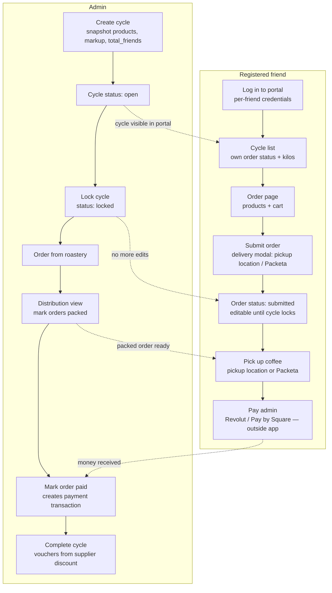
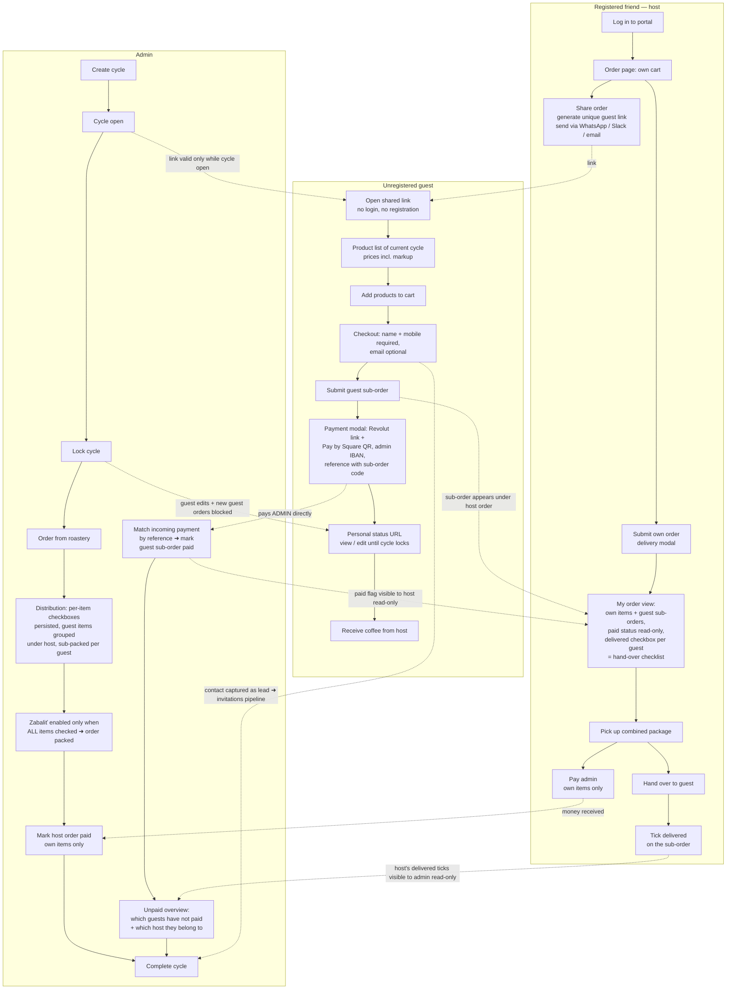
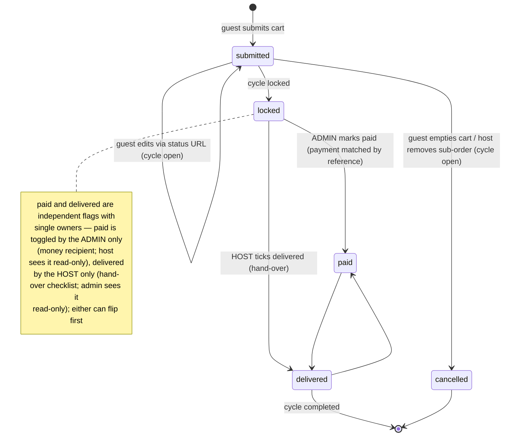

# Guest Shared Orders — Design Spec

**Date:** 2026-07-18 (finalized 2026-07-24)
**Status:** Final — decisions validated with the owner; ready for `/plan-backlog`
**UC prefix:** `UC-GSO-xxx` · **Backlog prefix:** `GSO-T#` (rows appended to `docs/specification/PROGRESS.md`)

## Goal

Let a registered friend (the **host**) share a unique link with unregistered people
(**guests** — typically colleagues). A guest can browse the products of the current
open cycle, build a cart, submit a **guest sub-order**, and pay the admin directly
(Revolut / Pay by Square QR) — all without registering. The guest sub-order lives
*under* the host's account: the host sees it (including its payment status,
read-only), hands the coffee over to the guest, and ticks off **delivered** per
sub-order as a hand-over checklist. The **admin** owns payment tracking — marks
each sub-order **paid** when the money arrives (the host sees that state
immediately) — and in the Distribution view packs the host's combined order with
**persisted per-item checkboxes** (own items + guest items), marking the whole
order packed only when every item is ticked.

Business goal: more kilos per cycle (tier thresholds) + captured guest contacts as
warm leads for the existing invitations pipeline.

## Current Ordering Process



Key properties of the current flow:

- One order per (friend, cycle). Order rows: `orders` (status `draft`/`submitted`,
  `paid`, `packed`), items in `order_items`.
- Payment happens **outside the app** (`PaymentModal.vue`: `revolut.me` link +
  Pay by Square QR from `paymentIban`/`paymentRevolutUsername` settings); admin
  records it by toggling `paid`, which creates a `payment` transaction against
  the friend's balance.
- Delivery = friend picks up at a pickup location or via Packeta. The
  Distribution view has per-item checkboxes, but their state is **frontend-only**
  (`Distribution.vue` `checkedItems` ref, keyed `friendId-itemIndex`) — lost on
  refresh; only the whole-order `packed`/`packed_at` is persisted. This spec
  fixes that (Decision 3).
- Friend auth (post SEC-A2/A3): per-friend session token as `Authorization:
  Bearer`, ownership enforced by `requireFriendOwner`/`enforceOrderOwnership`;
  the legacy shared password works only while `auth_mode = legacy`.

## New Process — Guest Sub-Orders Under a Friend's Order



### Guest sub-order lifecycle



## Key Design Decisions

### 1. Guests pay the admin directly — same Revolut + Pay by Square flow as friends

Friends already pay the admin directly through `PaymentModal.vue`: a
`revolut.me/<username>` link plus a Pay by Square QR generated from the admin's
IBAN (both from settings: `paymentIban`, `paymentRevolutUsername`), with a
payment `reference` prop. Guest sub-orders reuse this exact component:

- After submitting, the guest sees the **same payment modal**: Revolut link +
  Pay by Square QR with the exact sub-order amount and a payment reference of the
  form **`G<id> / GuestName / CycleName`** (e.g. `G12 / Marek / Máj 2026`). The
  `G<id>` code makes the incoming payment unambiguous even with duplicate first
  names. The Revolut path can't pre-fill a note, so the confirmation screen
  explicitly tells the guest to paste the reference into the Revolut note. The
  modal is re-openable from the guest's status URL ("Zaplatiť") until the
  sub-order is marked paid.
- The **admin** matches incoming payments by reference and toggles `paid` on the
  sub-order (admin cycle view, nested under the host order). An **unpaid
  overview** — guest name, amount, reference, host, contact — makes it obvious
  who hasn't paid; the existing per-cycle `unpaid_count` (`cycles.js`) includes
  guest sub-orders.
- Guest `paid` flags do **not** create `transactions` rows (guests have no
  balance account); `paid`/`paid_at` on `guest_orders` is the whole bookkeeping.
  The host's own payable total to the admin covers **their own items only** —
  guest sub-orders are the admin's receivables; guest totals never touch the
  host's balance.

A real payment gateway (Stripe/GoPay) remains out of scope for v1; payment is
confirmed manually, exactly as with friend orders today.

### 2. Single-owner flags: admin owns `paid`, host owns `delivered` *(corrected 2026-07-24)*

`paid` and `delivered` on a guest sub-order have **one owner each**, with the
other side seeing the state read-only:

- **`paid` — admin only.** The admin is the money recipient; they toggle `paid`
  (sets/clears `paid_at`) when a payment is matched by reference. The **host
  sees the paid state read-only** in their order view, so they know which of
  their colleagues has settled up. The host cannot toggle it — if a guest hands
  the host cash, the host forwards it and the admin marks paid on receipt.
- **`delivered` — host only.** The host's hand-over checklist: tick when the
  guest picks up their bag (sets/clears `delivered_at`). The **admin sees the
  host's ticks read-only** on the nested sub-orders (useful signal of hand-over
  progress), but never toggles them — the admin's own delivery tracking is the
  Distribution packing flow (Decision 3), which is a separate concept.

This supersedes an intermediate "both toggle both" idea — single ownership
keeps responsibilities unambiguous and removes concurrent-toggle conflicts.

### 3. Persisted per-item packing checkboxes; `packed` gated on all items *(decided 2026-07-24)*

The admin's whole-order delivery state **reuses the existing `packed`
("Zabalené") mark** — no new whole-order column. What changes:

- **Per-item checkbox state is persisted** (today it's the FE-only
  `checkedItems` ref in `Distribution.vue` and evaporates on refresh). New
  `packed INTEGER DEFAULT 0` column on **both `order_items` and
  `guest_order_items`**; the Distribution view loads and toggles it via
  admin endpoints. Partial delivery survives a refresh/another device: "4 of 5
  products handed over" is durable state. This fixes the existing gap for
  regular friend orders too, independent of guests.
- **Gating:** the "Zabaliť" button for a host's order stays a manual, explicit
  action but is **enabled only when every item checkbox is checked** — the
  friend's own `order_items` AND every item of every non-cancelled guest
  sub-order under them. Server-side, the packed endpoint rejects (409) if any
  item is unpacked. Unchecking an item on a packed order un-packs the order.

### 4. Separate tables, not rows in `orders`

Guest sub-orders get their own tables (`guest_orders`, `guest_order_items`)
instead of reusing `orders` with a `parent_order_id`:

- Many existing aggregations key on `orders` per friend: cycle progress
  (`submittedOrders/totalFriends`), analytics segmentation, vouchers, rewards.
  Guest rows inside `orders` would silently corrupt all of them.
- A guest sub-order must be attachable to `(host_friend_id, cycle_id)` even when
  the host hasn't submitted their own order yet, so a FK to `orders.id` is wrong
  anyway.
- Cycle totals / tier progress / distribution explicitly JOIN the guest tables
  where guest kilos should count (they should — that's the point of the feature).

### 5. Host gets the kilos credit *(confirmed 2026-07-24)*

Guest kilos count toward the **host's** rewards/voucher volume (they recruited
the guests and do the delivery) — this is the host's incentive to share the
link. Implementation seam: the kg queries in `backend/src/routes/rewards.js`
(JOIN on `order_items`) and `friend-groups.js` need a UNION with
`guest_order_items`, attributed to the link's `host_friend_id`. Mirrors the
existing `is_root`/`root_friend_id` grouping concept.

### 6. Link + edit-token model

- One shareable **guest link per (host, cycle)**: token in `guest_order_links`,
  URL `/g/:token`. Host can regenerate (invalidates old link, keeps existing
  sub-orders) or deactivate. Tokens are CSPRNG (`crypto.randomInt` alphabet per
  SEC-S2), long enough to be unguessable (≥12 chars).
- After submitting, a guest gets a **personal status URL** `/g/:token/o/:orderToken`
  (also persisted in guest's localStorage) to view status and edit items until the
  cycle locks. No account, no password.
- Links are only usable while the cycle status is `open`. Locked cycle ⇒
  read-only status page.
- **No cap** on sub-orders per link *(decided 2026-07-24)* — links are
  unguessable and shared privately at friend-group scale; the host can delete
  junk. The public guest endpoints DO get the existing `express-rate-limit`
  abuse limiter (same family as `/invitations/code/:code`).

### 7. Guest identity: name + mobile required, email optional *(decided 2026-07-24)*

Checkout requires **`guest_name` and `guest_phone`**; `guest_email` is optional.
Every guest is thereby a contactable lead for the invitations pipeline (which
also keys on phone). Backend validates presence + trivial shape (non-empty name;
phone ≥ 9 digits after stripping spaces); no SMS verification in v1.

### 8. Host control over sub-orders

- Guest items land directly in the sub-order (no approval step — friction kills
  group carts), but the host sees every sub-order live in their order view and can
  **remove a whole sub-order** while the cycle is open (typo, prank, colleague
  changed their mind offline).
- Host submitting their own order does **not** block further guest sub-orders;
  only the cycle lock does. The order view shows guest sub-orders and their
  running total live so the host knows what they'll be handing over.

## Data Model

```sql
CREATE TABLE guest_order_links (
  id INTEGER PRIMARY KEY AUTOINCREMENT,
  token TEXT UNIQUE NOT NULL,            -- URL token, CSPRNG, >= 12 chars
  host_friend_id INTEGER NOT NULL,
  cycle_id INTEGER NOT NULL,
  active INTEGER DEFAULT 1,
  created_at DATETIME DEFAULT CURRENT_TIMESTAMP,
  UNIQUE(host_friend_id, cycle_id),      -- one live link per host per cycle
  FOREIGN KEY (host_friend_id) REFERENCES friends(id) ON DELETE CASCADE,
  FOREIGN KEY (cycle_id) REFERENCES order_cycles(id) ON DELETE CASCADE
);

CREATE TABLE guest_orders (
  id INTEGER PRIMARY KEY AUTOINCREMENT,
  link_id INTEGER NOT NULL,              -- carries host + cycle
  order_token TEXT UNIQUE NOT NULL,      -- guest's personal status/edit URL
  guest_name TEXT NOT NULL,
  guest_phone TEXT NOT NULL,             -- required (lead capture, decided 2026-07-24)
  guest_email TEXT,                      -- optional
  status TEXT DEFAULT 'submitted' CHECK (status IN ('submitted', 'cancelled')),
  total REAL DEFAULT 0,
  paid INTEGER DEFAULT 0,                -- ADMIN-only toggle; host read-only
  paid_at DATETIME,
  delivered INTEGER DEFAULT 0,           -- HOST-only toggle; admin read-only
  delivered_at DATETIME,
  created_at DATETIME DEFAULT CURRENT_TIMESTAMP,
  FOREIGN KEY (link_id) REFERENCES guest_order_links(id) ON DELETE CASCADE
);

CREATE TABLE guest_order_items (
  id INTEGER PRIMARY KEY AUTOINCREMENT,
  guest_order_id INTEGER NOT NULL,
  product_id INTEGER NOT NULL,           -- cycle-snapshot products row
  variant TEXT NOT NULL,
  quantity INTEGER NOT NULL DEFAULT 1,
  price REAL NOT NULL,                   -- unit price incl. markup at submit time
  packed INTEGER DEFAULT 0,              -- distribution checkbox (admin), persisted
  FOREIGN KEY (guest_order_id) REFERENCES guest_orders(id) ON DELETE CASCADE,
  FOREIGN KEY (product_id) REFERENCES products(id) ON DELETE CASCADE
);

-- Existing table, new column (try/catch ALTER TABLE migration):
ALTER TABLE order_items ADD COLUMN packed INTEGER DEFAULT 0;  -- persists the
-- Distribution per-item checkboxes that are currently FE-only
```

New tables follow the existing `try/catch ALTER TABLE` migration convention in
`backend/src/db/schema.js` (plain `CREATE TABLE IF NOT EXISTS`).

## API Surface

Public (token-authenticated by URL, no session; abuse-rate-limited):

| Method | Path | Purpose |
|---|---|---|
| GET | `/api/guest/:token` | Cycle info + host first name + active products with prices; 410 if link inactive or cycle not open |
| POST | `/api/guest/:token/orders` | Submit guest sub-order `{guest_name, guest_phone, guest_email?, items[]}` → returns `order_token` + payment info (IBAN, Revolut username, reference `G<id> / name / cycle`, amount). 400 if name/phone missing; 409 if cycle not open |
| GET | `/api/guest/:token/orders/:orderToken` | Status page data (items, total, paid/delivered, payment info for re-opening the payment modal, cycle status) |
| PUT | `/api/guest/:token/orders/:orderToken` | Edit items while cycle open; empty cart ⇒ status `cancelled`; 409 if cycle locked |

Friend/host (Bearer per-friend session token; ownership via `requireFriendOwner`-style
check that the authenticated friend is the link's `host_friend_id` — 403 for any
other friend):

| Method | Path | Purpose |
|---|---|---|
| POST | `/api/guest-links/cycle/:cycleId` | Create or regenerate own link (regenerate replaces token, keeps sub-orders) |
| GET | `/api/guest-links/cycle/:cycleId` | Own link + all guest sub-orders for this cycle incl. paid (read-only) + delivered state |
| PATCH | `/api/guest-links/:id` | Deactivate link (host only) |
| PATCH | `/api/guest-orders/:id/delivered` | Toggle delivered — **host only** (sets/clears `delivered_at`) |
| DELETE | `/api/guest-orders/:id` | Remove sub-order (host only, cycle open) |

Admin-only (`requireAdmin`):

| Method | Path | Purpose |
|---|---|---|
| PATCH | `/api/guest-orders/:id/paid` | Toggle paid (sets/clears `paid_at`; no `transactions` row) |
| GET | `/api/guest-orders/cycle/:cycleId/unpaid` | Unpaid overview: guest name, amount, reference, host, contact |
| PATCH | `/api/order-items/:id/packed` | Toggle persisted distribution checkbox on a friend order item |
| PATCH | `/api/guest-order-items/:id/packed` | Toggle persisted distribution checkbox on a guest order item |

The existing whole-order packed endpoint gains server-side gating: marking a
host's order packed returns 409 unless every `order_items.packed` and every
`guest_order_items.packed` under that (friend, cycle) is 1 (cancelled
sub-orders excluded); unchecking any item on a packed order clears the order's
`packed` flag.

Plus: extend existing cycle detail / distribution / live-cycle / `friends/cycles`
endpoints to JOIN guest tables — orders tab shows guest sub-orders nested under
the host order (admin: paid toggle + read-only delivered indicator per
sub-order); kilos, tier progress, and per-cycle `unpaid_count` include guest
sub-orders; distribution payload includes persisted per-item `packed` state.

## Frontend

- **`GuestOrder.vue`** — public route `/g/:token` (+ `/g/:token/o/:orderToken`).
  Reuses the FriendOrder product-card layout (incl. bakery variant grouping) but
  stripped: no login, no delivery modal, no drafts. Checkout = name (required) +
  mobile (required) + email (optional) + submit. Confirmation screen opens the
  existing **`PaymentModal.vue`** (Revolut link + Pay by Square QR, amount +
  `G<id>` reference pre-filled) and shows the personal status URL; the status
  page has a "Zaplatiť" button to re-open the modal until the sub-order is
  marked paid. Slovak UI.
- **FriendOrder.vue / FriendPortal.vue** — "Zdieľať objednávku s kolegami" action
  (share link + copy button + native share sheet on mobile); section
  "Objednávky kolegov" listing sub-orders with a **read-only paid badge** and a
  **delivered checkbox per row** (the hand-over checklist), plus the host's own
  payable total (own items only, guest totals shown separately for context).
- **Admin CycleDetail** — guest sub-orders rendered nested under the host with a
  distinct badge (e.g. gray "Hosť • pozval Peťo"), a **paid toggle** and a
  **read-only delivered indicator** each; an unpaid-guests summary (name,
  amount, reference, host, contact) on the cycle detail.
- **Distribution.vue** — per-item checkboxes now **read/write persisted state**
  (replacing the local `checkedItems` ref) for both own and guest items; guest
  items grouped per guest under the host so bags can be pre-separated; the
  "Zabaliť" button disabled until all item checkboxes are checked (server
  enforces the same rule).

## Lead Capture

Every guest is a contactable lead (phone required). On the guest confirmation
screen, show a low-key CTA: "Chceš si nabudúce objednať sám? Požiadaj o účet" →
prefills the existing invitations flow (`invitations` table,
`invited_by_friend_id` = host, name/phone/email carried over). Admin invitations
view gains a "prišiel cez hosťovskú objednávku" source tag (reuse
`onboarding_source` pattern).

## Edge Cases

- **Cycle locks while guest cart is open** → submit returns 409 with a friendly
  Slovak message; status URL flips read-only.
- **Stock limits** (`products.stock_limit_g`) must count guest items too — the
  existing check (`orders.js`/`products.js`) needs a UNION over `order_items` +
  `guest_order_items`.
- **Host deactivates link** → existing sub-orders survive; only new visits break.
- **Host has no own order at lock time** → their "order" in admin views is the
  guest aggregate; distribution still shows the host as the pickup party. The
  packed gating then covers guest items only.
- **Guest edits after items were checked in distribution** → cannot happen:
  guest edits are only possible while the cycle is open, distribution happens
  after lock.
- **Host removes a sub-order that had packed items** → allowed only while the
  cycle is open (before distribution), so no conflict.
- **Duplicate guests** — same person may submit twice; host resolves by deleting
  one (no dedup logic in v1).
- **Markup** — guest prices use the same snapshot `products` prices ×
  `markup_ratio` logic as friend orders; price is frozen per item at submit time
  (same as `order_items.price` today).

## Use Cases (backlog anchors)

Guest flow:

- **UC-GSO-001** — Guest opens `/g/:token`: sees cycle name, host first name,
  product list with marked-up prices (incl. bakery variant grouping); 410 page
  if the link is inactive or the cycle isn't open.
- **UC-GSO-002** — Guest builds a cart and submits with name + mobile (email
  optional); server validates identity fields and cycle-open, creates
  `guest_orders` + items with frozen prices, returns `order_token` + payment
  info. Stock limits count guest items (UNION seam).
- **UC-GSO-003** — Guest sees confirmation with PaymentModal (Revolut + Pay by
  Square QR, amount, reference `G<id> / Name / Cycle`) and their personal
  status URL; status URL also lands in localStorage.
- **UC-GSO-004** — Guest revisits status URL: sees items, total, paid/delivered
  state; can re-open the payment modal until paid; can edit items while the
  cycle is open (empty cart ⇒ cancelled); read-only once locked.

Host flow:

- **UC-GSO-005** — Host creates/regenerates/deactivates their share link for a
  cycle from FriendOrder/FriendPortal (copy button + native share sheet);
  regeneration keeps existing sub-orders.
- **UC-GSO-006** — Host's order view lists guest sub-orders live (name, items,
  total, read-only paid badge) with the host's own payable total unchanged
  (own items only).
- **UC-GSO-007** — Host ticks/unticks delivered per sub-order (hand-over
  checklist; sets/clears `delivered_at`); the paid state is read-only for the
  host; another friend's token gets 403.
- **UC-GSO-008** — Host removes a whole sub-order while the cycle is open;
  guest's status URL then shows cancelled.

Admin flow:

- **UC-GSO-009** — Admin cycle detail (orders tab) shows guest sub-orders
  nested under the host with badge, a paid toggle (persists `paid`/`paid_at`,
  no `transactions` row) and a read-only delivered indicator reflecting the
  host's ticks.
- **UC-GSO-010** — Admin unpaid overview per cycle: guest name, amount,
  reference, host, contact; per-cycle `unpaid_count` includes guest sub-orders.
- **UC-GSO-011** — Distribution view groups guest items per guest under the
  host; per-item checkboxes persist to `order_items.packed` /
  `guest_order_items.packed` (survive refresh/another device); "Zabaliť" is
  disabled (and server rejects with 409) until all items under the host are
  checked; unchecking an item un-packs the order.
- **UC-GSO-012** — Per-item packed persistence works for ordinary friend
  orders with no guest sub-orders too (fixes the existing FE-only checkbox
  gap independently of the guest feature).

Aggregation & growth:

- **UC-GSO-013** — Cycle totals, tier progress, and the live-cycle dashboard
  include guest kilos.
- **UC-GSO-014** — Rewards/voucher volume credits guest kilos to the host
  (`rewards.js` + `friend-groups.js` UNION seam).
- **UC-GSO-015** — Guest confirmation CTA prefills an invitation
  (`invited_by_friend_id` = host, contact carried over); admin sees the
  guest-order source tag.

## Testing

Per `docs/specification/01-architecture.md`: no unit-test runner — the bar is
the Playwright suite in `e2e/` (target-agnostic via `BASE_URL`). New specs to
add: guest link create/share, guest submit (validation: missing phone → 400),
guest edit until lock + 409 after, host delivered toggle + paid read-only,
admin paid toggle visible to host, unpaid overview, per-item packed persistence
(check → reload → still checked) + packed gating 409, token auth boundaries
(foreign friend 403 on delivered/delete, friend token rejected on paid,
inactive link 410).

## Out of Scope (v1)

- Online payment gateway (Stripe/GoPay) — manual settlement only.
- Guest accounts / self-registration from the guest flow (only the invitations CTA).
- Per-guest delivery methods — the host's delivery covers the whole package.
- Notifications (email/SMS) to guests — the status URL is the only channel.
- Realtime sync between admin and host views (refresh/poll only).
- Audit trail of who toggled a flag / item checkbox.
- Sub-order cap / SMS phone verification / guest dedup.

## Resolved Questions (2026-07-24)

1. Guest kilos **do** count toward the host's voucher/rewards volume (Decision 5).
2. **`paid` is admin-only** (host read-only); **`delivered` is host-only**
   (admin read-only). The admin's delivery tracking is the Distribution packing
   flow: **per-item checkboxes persisted** on `order_items` +
   `guest_order_items`, with the existing whole-order `packed` mark gated
   (manual button, enabled only when all items checked) — Decisions 2 & 3.
3. **No cap** on sub-orders per link; public endpoints reuse the existing abuse
   rate limiter (Decision 6).
4. Guest identity: **name + mobile required**, email optional (Decision 7).
