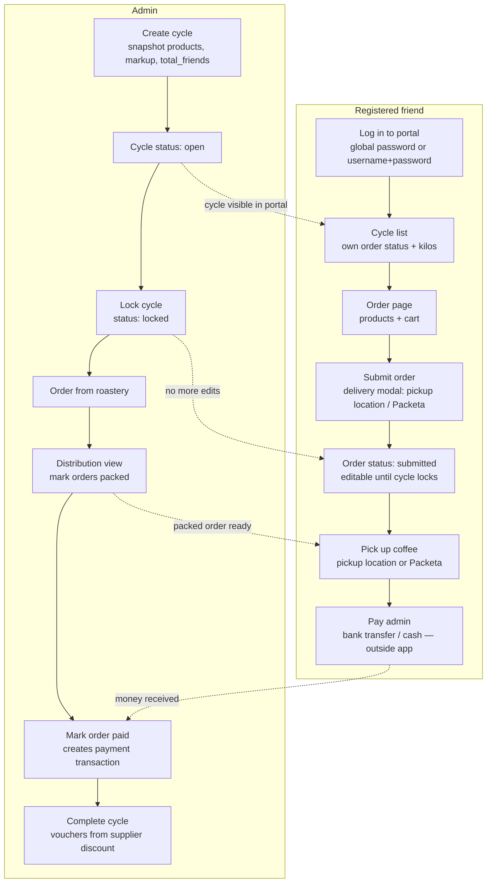
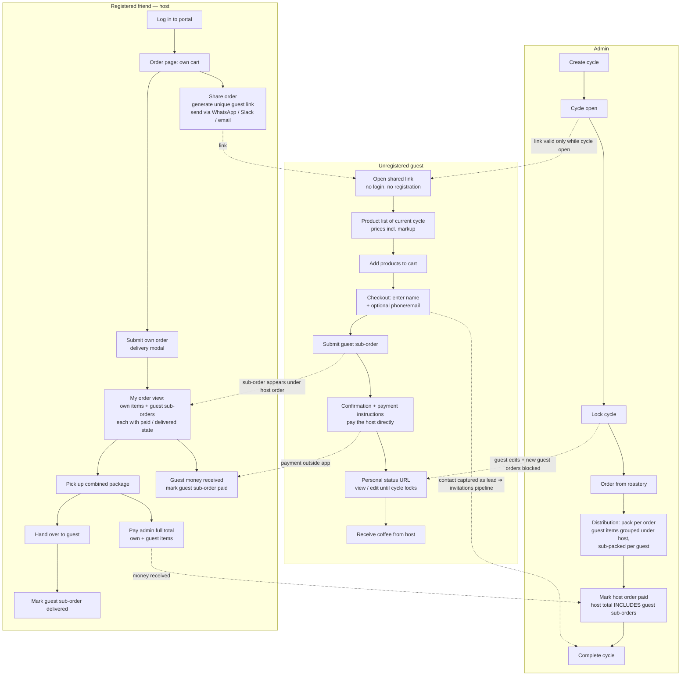
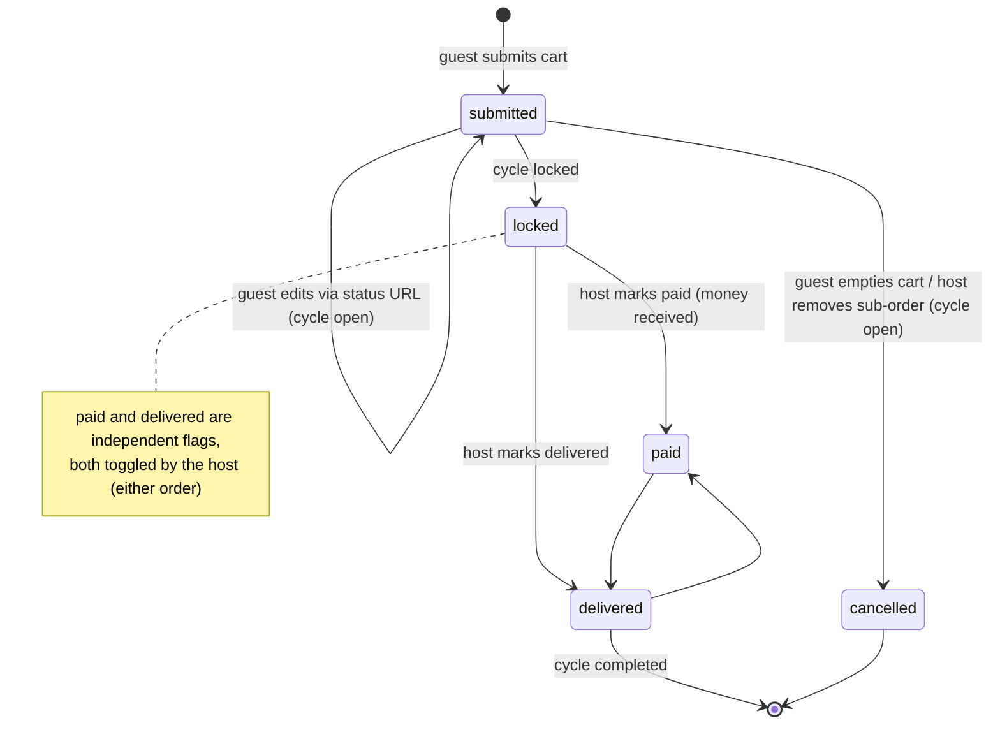

# Guest Shared Orders — Design Spec

**Date:** 2026-07-18
**Status:** Draft — process diagrams + core design for review

## Goal

Let a registered friend (the **host**) share a unique link with unregistered people
(**guests** — typically colleagues). A guest can browse the products of the current
open cycle, build a cart, submit a **guest sub-order**, and settle payment — all
without registering. The guest sub-order lives *under* the host's account: the host
sees it, tracks whether it is paid, and marks it as delivered (the host is
responsible for handing the coffee over to the guest).

Business goal: more kilos per cycle (tier thresholds) + captured guest contacts as
warm leads for the existing invitations pipeline.

## Current Ordering Process



Key properties of the current flow:

- One order per (friend, cycle). Order rows: `orders` (status `draft`/`submitted`,
  `paid`, `packed`), items in `order_items`.
- Payment happens **outside the app**; admin records it by toggling `paid`, which
  creates a `payment` transaction against the friend's balance.
- Delivery = friend picks up at a pickup location or via Packeta. Nothing in the
  app tracks hand-over beyond `packed`.

## New Process — Guest Sub-Orders Under a Friend's Order



### Guest sub-order lifecycle



## Key Design Decisions

### 1. Payment stays outside the app (v1)

There is no payment gateway anywhere in Gorifi today — friends pay the admin by
bank transfer or cash and the admin toggles `paid`. Guest sub-orders follow the
same honor-system pattern one level down:

- Guest checkout confirmation shows **payment instructions for paying the host**
  (free-text note the host can configure — e.g. IBAN, "pay by Revolut", "cash at
  the office"; optional QR code generated from IBAN + amount is a nice-to-have).
- The **host** toggles `paid` on each guest sub-order when the money arrives.
- The **admin** still marks the *host's* order paid as one unit — the host owes
  the admin the full total (own items + all guest items). Guest `paid` flags are
  host-facing bookkeeping, they do not create `transactions` rows.

A real payment gateway (Stripe/GoPay) is explicitly out of scope for v1; the
schema below doesn't preclude adding `payment_ref` later.

### 2. Separate tables, not rows in `orders`

Guest sub-orders get their own tables (`guest_orders`, `guest_order_items`)
instead of reusing `orders` with a `parent_order_id`:

- Many existing aggregations key on `orders` per friend: cycle progress
  (`submittedOrders/totalFriends`), analytics segmentation, vouchers, rewards.
  Guest rows inside `orders` would silently corrupt all of them.
- A guest sub-order must be attachable to `(host_friend_id, cycle_id)` even when
  the host hasn't submitted their own order yet, so a FK to `orders.id` is wrong
  anyway.
- Cycle totals / tier progress / distribution explicitly JOIN the guest tables
  where guest kilos should count (they should — that's the point of the feature).

### 3. Host gets the kilos credit

Guest kilos count toward the host's rewards/voucher volume (they already carry
the settlement risk and do the delivery). This doubles as the host's incentive to
share the link. Mirrors the existing `is_root`/`root_friend_id` grouping concept.

### 4. Link + edit-token model

- One shareable **guest link per (host, cycle)**: token in `guest_order_links`,
  URL `/g/:token`. Host can regenerate (invalidates old link, keeps existing
  sub-orders) or deactivate.
- After submitting, a guest gets a **personal status URL** `/g/:token/o/:orderToken`
  (also persisted in guest's localStorage) to view status and edit items until the
  cycle locks. No account, no password.
- Links are only usable while the cycle status is `open`. Locked cycle ⇒
  read-only status page.

### 5. Host control over sub-orders

- Guest items land directly in the sub-order (no approval step — friction kills
  group carts), but the host sees every sub-order live in their order view and can
  **remove a whole sub-order** while the cycle is open (typo, prank, colleague
  changed their mind offline).
- Host submitting their own order does **not** block further guest sub-orders;
  only the cycle lock does. The host's payable total is therefore final only at
  lock time — the order view must show "own total + guest total = payable total"
  live.

## Data Model

```sql
CREATE TABLE guest_order_links (
  id INTEGER PRIMARY KEY AUTOINCREMENT,
  token TEXT UNIQUE NOT NULL,            -- URL token, generateUid()-style
  host_friend_id INTEGER NOT NULL,
  cycle_id INTEGER NOT NULL,
  payment_note TEXT,                     -- host's payment instructions for guests
  active INTEGER DEFAULT 1,
  created_at DATETIME DEFAULT CURRENT_TIMESTAMP,
  UNIQUE(host_friend_id, cycle_id),      -- one live link per host per cycle
  FOREIGN KEY (host_friend_id) REFERENCES friends(id) ON DELETE CASCADE,
  FOREIGN KEY (cycle_id) REFERENCES order_cycles(id) ON DELETE CASCADE
);

CREATE TABLE guest_orders (
  id INTEGER PRIMARY KEY AUTOINCREMENT,
  link_id INTEGER NOT NULL,              -- carries host + cycle
  order_token TEXT UNIQUE NOT NULL,      -- guest's personal status/edit URL
  guest_name TEXT NOT NULL,
  guest_phone TEXT,
  guest_email TEXT,
  status TEXT DEFAULT 'submitted' CHECK (status IN ('submitted', 'cancelled')),
  total REAL DEFAULT 0,
  paid INTEGER DEFAULT 0,
  paid_at DATETIME,
  delivered INTEGER DEFAULT 0,
  delivered_at DATETIME,
  created_at DATETIME DEFAULT CURRENT_TIMESTAMP,
  FOREIGN KEY (link_id) REFERENCES guest_order_links(id) ON DELETE CASCADE
);

CREATE TABLE guest_order_items (
  id INTEGER PRIMARY KEY AUTOINCREMENT,
  guest_order_id INTEGER NOT NULL,
  product_id INTEGER NOT NULL,           -- cycle-snapshot products row
  variant TEXT NOT NULL,
  quantity INTEGER NOT NULL DEFAULT 1,
  price REAL NOT NULL,                   -- unit price incl. markup at submit time
  FOREIGN KEY (guest_order_id) REFERENCES guest_orders(id) ON DELETE CASCADE,
  FOREIGN KEY (product_id) REFERENCES products(id) ON DELETE CASCADE
);
```

## API Surface

Public (token-authenticated by URL, no session):

| Method | Path | Purpose |
|---|---|---|
| GET | `/api/guest/:token` | Cycle info + host first name + active products with prices; 410 if link inactive or cycle not open |
| POST | `/api/guest/:token/orders` | Submit guest sub-order `{guest_name, guest_phone?, guest_email?, items[]}` → returns `order_token` |
| GET | `/api/guest/:token/orders/:orderToken` | Status page data (items, total, paid/delivered, payment note, cycle status) |
| PUT | `/api/guest/:token/orders/:orderToken` | Edit items while cycle open; empty cart ⇒ status `cancelled` |

Friend (existing `X-Friends-Password` / session auth):

| Method | Path | Purpose |
|---|---|---|
| POST | `/api/guest-links/cycle/:cycleId` | Create or regenerate own link (`{payment_note?}`) |
| GET | `/api/guest-links/cycle/:cycleId` | Own link + all guest sub-orders for this cycle |
| PATCH | `/api/guest-links/:id` | Deactivate / update payment note |
| PATCH | `/api/guest-orders/:id/paid` | Toggle paid (host only) |
| PATCH | `/api/guest-orders/:id/delivered` | Toggle delivered (host only) |
| DELETE | `/api/guest-orders/:id` | Remove sub-order (host only, cycle open) |

Admin: extend existing cycle detail / distribution / live-cycle endpoints to JOIN
guest tables — orders tab shows guest sub-orders nested under host order; kilos
and tier progress include guest items.

## Frontend

- **`GuestOrder.vue`** — public route `/g/:token` (+ `/g/:token/o/:orderToken`).
  Reuses the FriendOrder product-card layout (incl. bakery variant grouping) but
  stripped: no login, no delivery modal, no drafts. Checkout = name + contact +
  submit. Confirmation screen = payment note + status URL. Slovak UI.
- **FriendOrder.vue / FriendPortal.vue** — "Zdieľať objednávku s kolegami" action
  (share link + copy button + native share sheet on mobile); section
  "Objednávky kolegov" listing sub-orders with per-row paid/delivered toggles and
  live payable total (own + guests).
- **Admin CycleDetail / Distribution** — guest sub-orders rendered nested under
  the host with a distinct badge (e.g. gray "Hosť • pozval Peťo"); packing
  checkboxes per guest sub-order so the host receives pre-separated bags.

## Lead Capture

Every guest with a phone/email is a warm lead. On the guest confirmation screen,
show a low-key CTA: "Chceš si nabudúce objednať sám? Požiadaj o účet" → prefills
the existing invitations flow (`invitations` table, `invited_by_friend_id` =
host). Admin invitations view gains a "prišiel cez hosťovskú objednávku" source
tag (reuse `onboarding_source` pattern).

## Edge Cases

- **Cycle locks while guest cart is open** → submit returns 409 with a friendly
  Slovak message; status URL flips read-only.
- **Stock limits** (`products.stock_limit_g`) must count guest items too — the
  existing check needs a UNION over `order_items` + `guest_order_items`.
- **Host deactivates link** → existing sub-orders survive; only new visits break.
- **Host has no own order at lock time** → their "order" in admin views is the
  guest aggregate; distribution still shows the host as the pickup party.
- **Duplicate guests** — same person may submit twice; host resolves by deleting
  one (no dedup logic in v1).
- **Markup** — guest prices use the same snapshot `products` prices ×
  `markup_ratio` logic as friend orders; price is frozen per item at submit time
  (same as `order_items.price` today).

## Out of Scope (v1)

- Online payment gateway (Stripe/GoPay) — manual settlement only.
- Guest accounts / self-registration from the guest flow (only the invitations CTA).
- Per-guest delivery methods — the host's delivery covers the whole package.
- Notifications (email/SMS) to guests — the status URL is the only channel.

## Open Questions

1. Should guest sub-order kilos count toward the **host's voucher volume**
   (recommended, see Decision 3) or be excluded from rewards?
2. Payment note per link vs. a per-friend default stored on `friends` (reusable
   across cycles)? Per-link is simpler; per-friend is less repetitive.
3. Should the admin be able to toggle guest `paid`/`delivered` too (support
   scenario), or host-only?
4. Cap on sub-orders per link (spam guard) — is a soft cap of e.g. 20 needed at
   this scale, or skip entirely?
